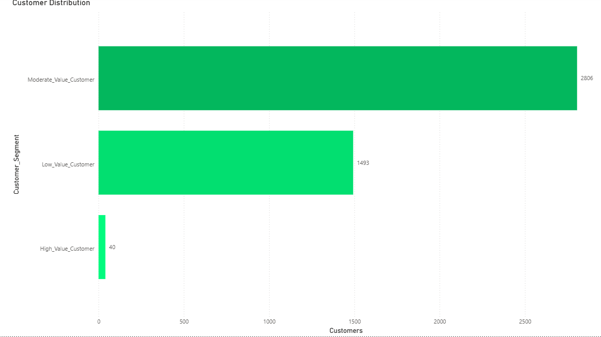
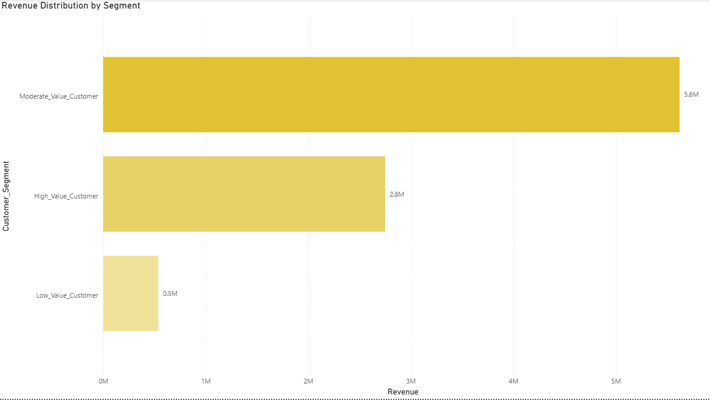
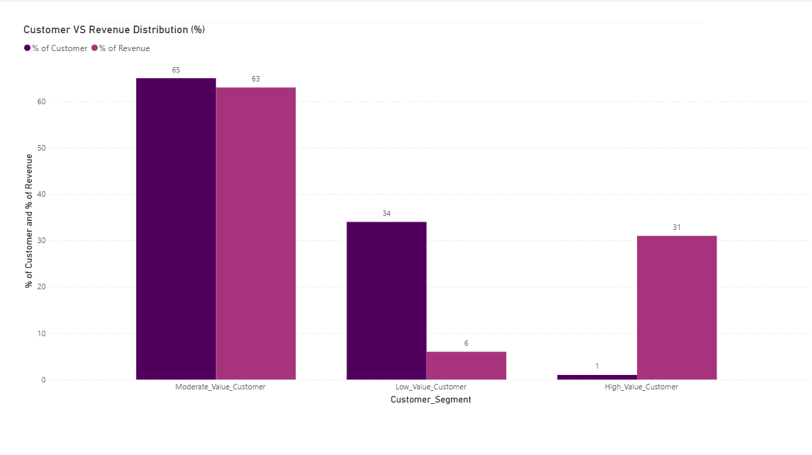
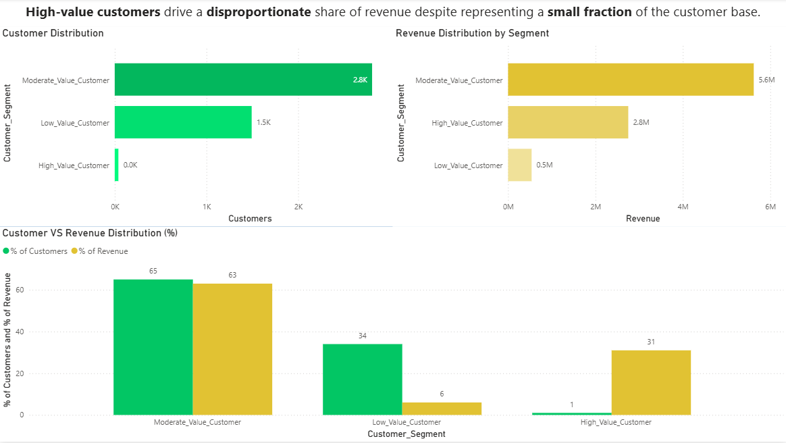

# customer-segmentation-analysis
customer segmentation analysis using SQL and Power BI
# Customer Segmentation Analysis – Online Retail Dataset

## Key Insight

A small group of high-value customers (~1%) generates a disproportionately large share of revenue (~31%), highlighting a strong imbalance in customer value distribution.

## Objective
The goal of this project was to analyze customer purchasing behavior by identifying distinct customer segments based on purchase frequency and revenue contribution.
The dataset used is the Online Retail dataset, which includes transactional data such as invoices, products, and customer identifiers.
## Methodology
The first step was to calculate the total number of orders and total revenue generated per customer. Due to the nature of the dataset, some basic data cleaning was required: cancelled orders (identified by invoice numbers starting with “C”) and records with missing customer IDs were excluded.
Customers were then segmented into three groups:
High-value customers
Moderate-value customers
Low-value customers
This segmentation was based on a combination of purchase frequency and total revenue.
To better compare the segments, results were converted into percentages, making it easier to visualize each segment’s contribution to both customer count and total revenue.
## Findings
The analysis revealed clear differences between customer segments:
High-value customers represent approximately 1% of the total customer base, yet contribute a disproportionately large share of total revenue (~31%). While these customers generate high revenue, they do not necessarily purchase frequently.
Moderate-value customers make up the majority of both the customer base and total revenue. They purchase more consistently, though with lower individual transaction values compared to high-value customers.
Low-value customers represent around 34% of customers but contribute only 6% of total revenue, highlighting a significant imbalance between customer volume and revenue contribution.
## Business Insights and Recommendations
The analysis revealed clear differences between customer segments:
High-value customers represent approximately 1% of the total customer base, yet contribute a disproportionately large share of total revenue (~31%). While these customers generate high revenue, they do not necessarily purchase frequently.
Moderate-value customers make up the majority of both the customer base and total revenue. They purchase more consistently, though with lower individual transaction values compared to high-value customers.
Low-value customers represent around 34% of customers but contribute only 6% of total revenue, highlighting a significant imbalance between customer volume and revenue contribution.
## Dashboard

### Customer Distribution

### Revenue Distribution

### Segment Comparison

### Customer Comparison 

## Tools Used

- SQL (SQLite, DBeaver)
- Power BI
- GitHub
